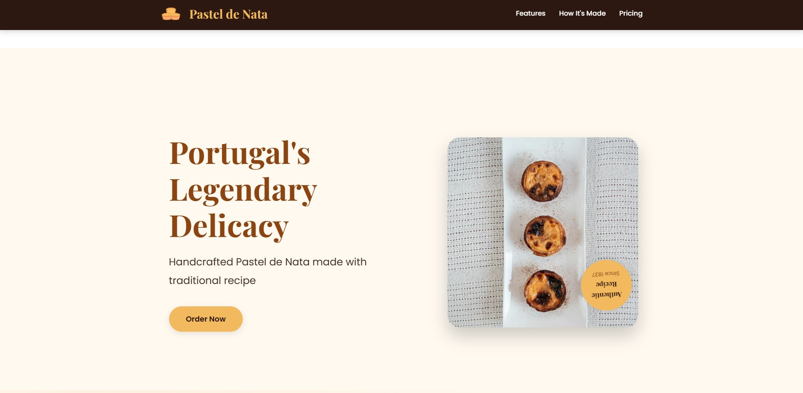
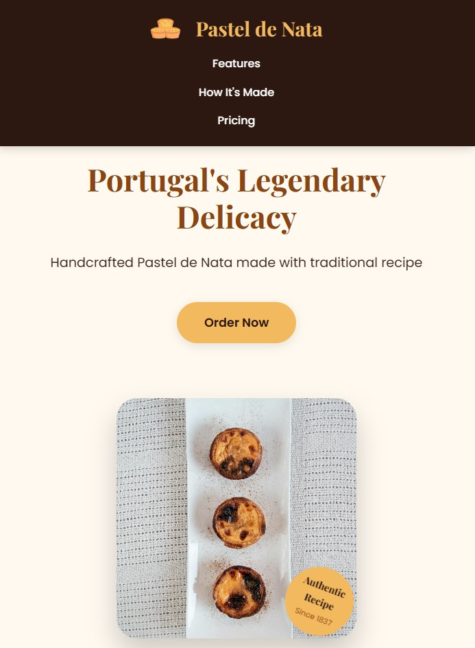

# Pastel de Nata Landing Page

This project is a simple web application of Pastel de Nata Landing Page. The project was developed using HTML and CSS and published using GitHub Pages.

Contents

- [Project URL](#project-urls)
- [Features](#features)
- [Project Content](#project-content)
- [Screenshot](#screenshot)
- [Challenge](#challenge)
- [Technologies-Used](#Technologies-Used)
- [Author](#author)
- [License](#license)
- [Show-Your-Support](#show-your-support)

# Project URL

The project is published at: [References Pastel de Nata Landing Page](https://mkalkandev.github.io/pastel-de-nata-landing-page/)

# Features

- **Responsive Design:** Provides a good user experience on mobile devices.
- **Simple and User Friendly Interface:** Provides easy access to recipe information.

- **Modern HTML and CSS Techniques:** Clean and maintainable code structure.

# Project Content

This project contains the following files and folders:

- **index.html:** HTML file for the home page.

- **style.css:** CSS file that creates the design of the project.

- **images/**: Folder containing images used in the page.

# Screenshot

# Challenge

My app allows users to:

Display the most appropriate layout for the app based on their device's screen size
See the navigation states for all interactive elements on the page
ongoing development
This was my sixth project with HTML and CSS and I'm happy with the result. This time I tried to learn new things, so I tried to structure HTML better and used flex and grid in CSS and introduced CSS keyframes and pseudo element properties.

I plan to continue exploring and learning more about this technology, so there will definitely be more projects related to it soon.

# Technologies Used

Operating System

first scene

 

tools

 

# Author

👤MustafaKalkan

Github:<a href="https://github.com/mkalkandev/" target="_blank">@mkalkandev</a>

Front End Mentor:<a href="https://www.frontendmentor.io/profile/mkalkandev" target="_blank">@mkalkandev</a>

# License

📝 Copyright © 2024 MustafaKalkan.

This project is licensed by [MIT](./LICENSE).

# Show your support

If you found this project useful, give it a ⭐️! Have fun building it! 🚀
